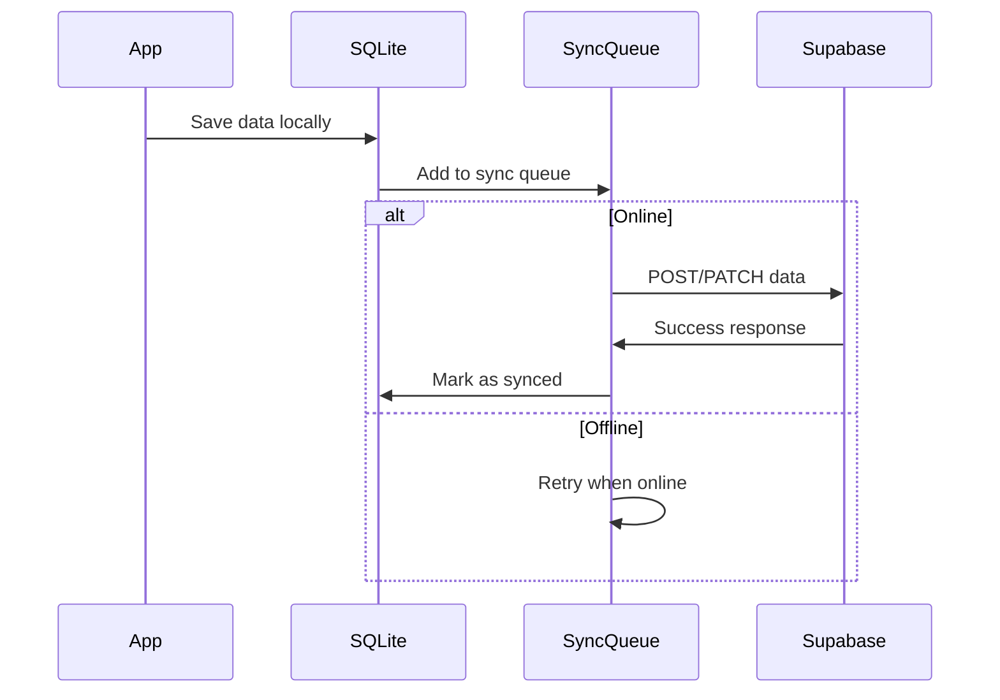

# MotivAid - API Design

## Overview

MotivAid uses **Supabase** as the backend, leveraging its auto-generated REST API and real-time subscriptions. The React Native Expo frontend communicates with Supabase using the `@supabase/supabase-js` client library with a custom SecureStore adapter for encrypted token storage.

---

## Supabase Client Setup

```typescript
// lib/supabase.ts
import 'react-native-url-polyfill/auto';
import * as SecureStore from 'expo-secure-store';
import { createClient } from '@supabase/supabase-js';
import { Platform } from 'react-native';

const ExpoSecureStoreAdapter = {
  getItem: (key: string) => {
    if (Platform.OS === 'web') {
      return Promise.resolve(localStorage.getItem(key));
    }
    return SecureStore.getItemAsync(key);
  },
  setItem: (key: string, value: string) => {
    if (Platform.OS === 'web') {
      localStorage.setItem(key, value);
      return;
    }
    SecureStore.setItemAsync(key, value);
  },
  removeItem: (key: string) => {
    if (Platform.OS === 'web') {
      localStorage.removeItem(key);
      return;
    }
    SecureStore.deleteItemAsync(key);
  },
};

const supabaseUrl = process.env.EXPO_PUBLIC_SUPABASE_URL!;
const supabaseAnonKey = process.env.EXPO_PUBLIC_SUPABASE_ANON_KEY!;

export const supabase = createClient(supabaseUrl, supabaseAnonKey, {
  auth: {
    storage: ExpoSecureStoreAdapter,
    autoRefreshToken: true,
    persistSession: true,
    detectSessionInUrl: false,
  },
});
```

---

## Authentication API

### Sign In (Online)

```typescript
const { data, error } = await supabase.auth.signInWithPassword({
  email: 'midwife@facility.com',
  password: 'securePassword123',
});
```

### Sign Up (Registration)

```typescript
const { error } = await supabase.auth.signUp({
  email,
  password,
  options: {
    data: {
      full_name: 'Jane Doe',
      role: 'midwife',                    // Sent for UI reference
      registration_code: 'ABC123',        // Used by trigger for role assignment
    },
  },
});
```

### Sign Out

```typescript
await supabase.auth.signOut();
```

### Session Management

```typescript
// Get current session
const { data: { session } } = await supabase.auth.getSession();

// Listen for auth state changes
const { data: { subscription } } = supabase.auth.onAuthStateChange(
  (_event, session) => {
    // Handle session changes
  }
);
```

### Password Recovery

```typescript
const { error } = await supabase.auth.resetPasswordForEmail(email);
```

---

## Profiles API

### Fetch Profile

```typescript
const { data, error } = await supabase
  .from('profiles')
  .select('*')
  .eq('id', userId);
```

### Update Profile

```typescript
const { error } = await supabase.from('profiles').upsert({
  id: user.id,
  username: 'jane_doe',
  full_name: 'Jane Doe',
  website: 'https://example.com',
  avatar_url: 'path/to/avatar.jpg',
  updated_at: new Date().toISOString(),
});
```

---

## Facilities API

### List All Facilities

```typescript
const { data, error } = await supabase
  .from('facilities')
  .select('*');
```

---

## Units API

### List Units with Facility Names

```typescript
const { data, error } = await supabase
  .from('units')
  .select('id, name, facility_id, facilities(name)');
```

### List Units for a Staff Member

```typescript
// 1. Get approved membership unit IDs
const { data: memberships } = await supabase
  .from('unit_memberships')
  .select('unit_id')
  .eq('profile_id', userId)
  .eq('status', 'approved');

const unitIds = memberships?.map(m => m.unit_id) || [];

// 2. Fetch those units
const { data, error } = await supabase
  .from('units')
  .select('id, name, facility_id, facilities(name)')
  .in('id', unitIds);
```

---

## Unit Memberships API

### Fetch Pending Memberships (Supervisor)

```typescript
const { data, error } = await supabase
  .from('unit_memberships')
  .select(`
    id,
    status,
    unit_id,
    profiles(full_name, avatar_url, role),
    units(name)
  `)
  .eq('status', 'pending');
```

### Approve / Reject Membership

```typescript
const { error } = await supabase
  .from('unit_memberships')
  .update({ status: 'approved' })  // or 'rejected'
  .eq('id', membershipId);
```

---

## Facility Codes API

### Validate Registration Code

```typescript
const { data, error } = await supabase
  .from('facility_codes')
  .select('role, is_active, facilities(name)')
  .eq('code', 'AKTH1-SUP')
  .maybeSingle();
```

**Response shape:**
```json
{
  "role": "supervisor",
  "is_active": true,
  "facilities": { "name": "Aminu Kano Teaching Hospital (AKTH)" }
}
```

### Toggle Code Activation

```typescript
const { error } = await supabase
  .from('facility_codes')
  .update({ is_active: false })
  .eq('id', codeId);
```

### Create Facility with Codes

```typescript
// 1. Create facility
const { data: facility, error } = await supabase
  .from('facilities')
  .insert({ name: 'New Hospital', location: 'City' })
  .select('id, name')
  .single();

// 2. Insert pre-generated codes
const { error: codeError } = await supabase
  .from('facility_codes')
  .insert([
    { facility_id: facility.id, role: 'supervisor', code: 'NH1-SUP', is_active: true },
    { facility_id: facility.id, role: 'midwife', code: 'NH1-MID', is_active: true },
    { facility_id: facility.id, role: 'nurse', code: 'NH1-NUR', is_active: true },
    { facility_id: facility.id, role: 'student', code: 'NH1-STU', is_active: true },
  ]);
```

---

## Storage API (Avatars)

### Download Avatar

```typescript
const { data, error } = await supabase.storage
  .from('avatars')
  .download(profile.avatar_url);

// Convert blob to data URI for Image component
const fr = new FileReader();
fr.readAsDataURL(data);
fr.onload = () => setAvatarUrl(fr.result as string);
```

### Upload Avatar

```typescript
import { decode } from 'base64-arraybuffer';

const { error } = await supabase.storage
  .from('avatars')
  .upload(filePath, decode(base64Data), {
    contentType: 'image/jpeg',
    upsert: true,
  });
```

---

## Offline Authentication

### Save Credentials for Offline Use

```typescript
// lib/security.native.ts
import * as Crypto from 'expo-crypto';
import * as SecureStore from 'expo-secure-store';

const hash = await Crypto.digestStringAsync(
  Crypto.CryptoDigestAlgorithm.SHA256,
  email.toLowerCase() + password
);

await SecureStore.setItemAsync('motivaid_offline_creds', JSON.stringify({
  email: email.toLowerCase(),
  hash,
}));
```

### Verify Offline Credentials

```typescript
const stored = await SecureStore.getItemAsync('motivaid_offline_creds');
const { email: storedEmail, hash: storedHash } = JSON.parse(stored);

const currentHash = await Crypto.digestStringAsync(
  Crypto.CryptoDigestAlgorithm.SHA256,
  email.toLowerCase() + password
);

const isValid = email.toLowerCase() === storedEmail && currentHash === storedHash;
```

---

## SQLite Cache API (Native Only)

### Cache Profile

```typescript
// lib/db.native.ts
const db = await SQLite.openDatabaseAsync('motivaid_offline_v2.db');

await db.runAsync(
  'INSERT OR REPLACE INTO profile_cache (id, profile_data, user_data, updated_at) VALUES (?, ?, ?, CURRENT_TIMESTAMP)',
  [userId, JSON.stringify(profileData), JSON.stringify(userData)]
);
```

### Get Cached Profile

```typescript
const result = await db.getFirstAsync<{ profile_data: string; user_data: string }>(
  'SELECT profile_data, user_data FROM profile_cache WHERE id = ?',
  [userId]
);

const profile = JSON.parse(result.profile_data);
const user = result.user_data ? JSON.parse(result.user_data) : null;
```

---

## Planned APIs (Future Phases)

### Maternal Profiles (Phase 3)

```typescript
// Create maternal profile
const { data, error } = await supabase
  .from('maternal_profiles')
  .insert([{
    facility_id: 'uuid',
    age: 28,
    parity: 2,
    has_anemia: false,
    has_pph_history: true,
    has_multiple_pregnancy: false,
  }])
  .select();
```

### PPH Cases (Phase 4)

```typescript
// Create case
const { data, error } = await supabase
  .from('pph_cases')
  .insert([{
    facility_id: 'uuid',
    maternal_profile_id: 'uuid',
    midwife_id: 'uuid',
    delivery_time: new Date().toISOString(),
    status: 'active',
  }])
  .select();

// Get case with relations
const { data, error } = await supabase
  .from('pph_cases')
  .select(`
    *,
    maternal_profile:maternal_profiles(*),
    midwife:profiles(full_name, phone),
    interventions(*),
    vital_signs(*)
  `)
  .eq('id', caseId);
```

### Interventions (Phase 4)

```typescript
const { data, error } = await supabase
  .from('interventions')
  .insert([{
    pph_case_id: 'uuid',
    type: 'oxytocin',
    name: 'Oxytocin 10 IU IM',
    performed_by: 'uuid',
    dosage: '10 IU',
    route: 'IM',
    is_completed: true,
  }])
  .select();
```

### Vital Signs (Phase 3)

```typescript
const { data, error } = await supabase
  .from('vital_signs')
  .insert([{
    pph_case_id: 'uuid',
    heart_rate: 110,
    systolic_bp: 90,
    diastolic_bp: 60,
    recorded_by: 'uuid',
  }])
  .select();
```

---

## Error Handling Pattern

```typescript
const { data, error } = await supabase.from('table').select('*');

if (error) {
  // Show user-facing error
  showToast(error.message, 'error');

  // Haptic feedback
  Haptics.notificationAsync(Haptics.NotificationFeedbackType.Error);

  // For forms, set field-specific errors
  if (error.message.includes('Invalid credentials')) {
    setPasswordError('Incorrect email or password');
  }
}
```

---

## Network-Aware Operations

```typescript
import NetInfo from '@react-native-community/netinfo';

const netState = await NetInfo.fetch();

if (netState.isConnected) {
  // Online: call Supabase directly
  const { data } = await supabase.from('profiles').select('*').eq('id', userId);
} else {
  // Offline: use SQLite cache
  const cached = await getCachedProfile(userId);
}
```

---

## Planned: Offline Sync Strategy



### Conflict Resolution (Planned)
1. **Last-write-wins** for simple fields
2. **Merge** for array fields (interventions)
3. **Server-priority** for critical fields (case status)
