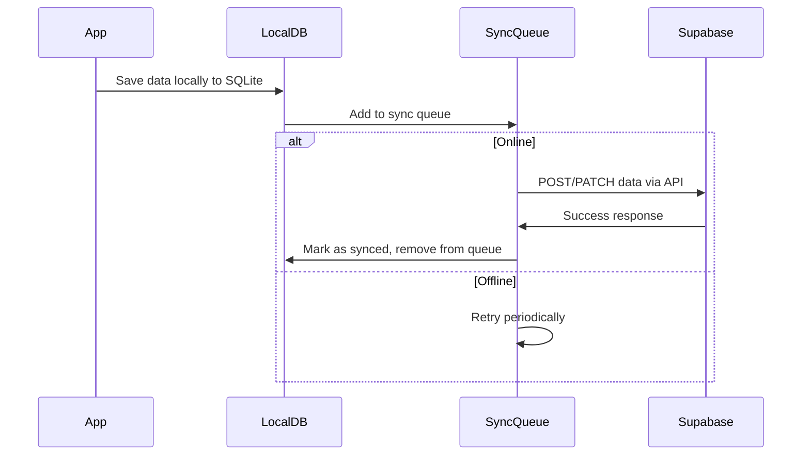

# MotivAid - API Design (React Native Expo)

## Overview

MotivAid uses **Supabase** as the backend, leveraging its auto-generated REST API and real-time subscriptions. The React Native Expo frontend communicates with Supabase using the JavaScript client library.

---

## Authentication API

### Login
```javascript
import { createClient } from '@supabase/supabase-js';

const supabase = createClient('https://<project-ref>.supabase.co', '<anon-key>');

const { data, error } = await supabase.auth.signInWithPassword({
  email: 'midwife@facility.com',
  password: 'securePassword123'
});
```

**Response:**
```json
{
  "data": {
    "user": {
      "id": "uuid",
      "email": "midwife@facility.com",
      "role": "midwife"
    },
    "session": {
      "access_token": "eyJ...",
      "refresh_token": "eyJ...",
      "expires_in": 3600
    }
  },
  "error": null
}
```

### Logout
```javascript
const { error } = await supabase.auth.signOut();
```

### Refresh Token
Handled automatically by the Supabase client library.

---

## Data API (REST)

All data endpoints follow the Supabase PostgREST pattern using the JavaScript client.

### Initialize Supabase Client
```javascript
// services/api/supabaseClient.js
import { createClient } from '@supabase/supabase-js';

const supabaseUrl = 'https://<project-ref>.supabase.co';
const supabaseAnonKey = '<anon-key>';

export const supabase = createClient(supabaseUrl, supabaseAnonKey);
```

---

## Facilities

### Get User's Facility
```javascript
const { data, error } = await supabase
  .from('facilities')
  .select('*')
  .eq('id', facilityId);
```

### List All Facilities (Admin Only)
```javascript
const { data, error } = await supabase
  .from('facilities')
  .select('*')
  .eq('is_active', true);
```

---

## Maternal Profiles

### Create Profile
```javascript
const { data, error } = await supabase
  .from('maternal_profiles')
  .insert([{
    facility_id: 'uuid',
    age: 28,
    parity: 2,
    has_anemia: false,
    has_pph_history: true,
    has_multiple_pregnancy: false
  }])
  .select();
```

### Get Profile
```javascript
const { data, error } = await supabase
  .from('maternal_profiles')
  .select('*')
  .eq('id', profileId);
```

### Calculate Risk Level (Edge Function)
```javascript
const { data, error } = await supabase.functions.invoke('calculate-risk', {
  body: {
    age: 28,
    parity: 2,
    has_anemia: true,
    has_pph_history: true,
    has_multiple_pregnancy: false
  }
});
```

**Response:**
```json
{
  "data": {
    "risk_level": "high",
    "risk_factors": ["anemia", "pph_history"],
    "recommendations": [
      "Prepare IV access",
      "Have uterotonics ready",
      "Increase monitoring frequency"
    ]
  }
}
```

---

## PPH Cases

### Create Case
```javascript
const { data, error } = await supabase
  .from('pph_cases')
  .insert([{
    facility_id: 'uuid',
    maternal_profile_id: 'uuid',
    midwife_id: 'uuid',
    delivery_time: '2026-01-26T10:30:00Z',
    status: 'active'
  }])
  .select();
```

### Update Case
```javascript
const { data, error } = await supabase
  .from('pph_cases')
  .update({ 
    blood_loss_ml: 750,
    shock_index: 1.2,
    status: 'active' 
  })
  .eq('id', caseId);
```

### Get Case with Relations
```javascript
const { data, error } = await supabase
  .from('pph_cases')
  .select(`
    *,
    maternal_profile:maternal_profiles(*),
    midwife:profiles(full_name,phone),
    interventions(*),
    vital_signs(*)
  `)
  .eq('id', caseId);
```

### List Facility Cases
```javascript
const { data, error } = await supabase
  .from('pph_cases')
  .select('*')
  .eq('facility_id', facilityId)
  .order('started_at', { ascending: false })
  .limit(20);
```

### Close Case
```javascript
const { data, error } = await supabase
  .from('pph_cases')
  .update({ 
    status: 'resolved',
    outcome: 'resolved',
    ended_at: '2026-01-26T12:00:00Z'
  })
  .eq('id', caseId);
```

---

## Interventions

### Log Intervention
```javascript
const { data, error } = await supabase
  .from('interventions')
  .insert([{
    pph_case_id: 'uuid',
    type: 'oxytocin',
    name: 'Oxytocin 10 IU IM',
    performed_by: 'uuid',
    dosage: '10 IU',
    route: 'IM',
    is_completed: true
  }])
  .select();
```

### Get Case Interventions
```javascript
const { data, error } = await supabase
  .from('interventions')
  .select('*')
  .eq('pph_case_id', caseId)
  .order('performed_at', { ascending: true });
```

---

## Vital Signs

### Record Vital Signs
```javascript
const { data, error } = await supabase
  .from('vital_signs')
  .insert([{
    pph_case_id: 'uuid',
    heart_rate: 110,
    systolic_bp: 90,
    diastolic_bp: 60,
    recorded_by: 'uuid'
  }])
  .select();
```

### Get Case Vital Signs History
```javascript
const { data, error } = await supabase
  .from('vital_signs')
  .select('*')
  .eq('pph_case_id', caseId)
  .order('recorded_at', { ascending: true });
```

---

## Training

### Start Training Session
```javascript
const { data, error } = await supabase
  .from('training_sessions')
  .insert([{
    profile_id: 'uuid',  // Changed from user_id to profile_id to match schema
    scenario_id: 'scenario_001'
  }])
  .select();
```

### Complete Session
```javascript
const { data, error } = await supabase
  .from('training_sessions')
  .update({
    completed_at: '2026-01-26T11:00:00Z',
    score: 85.5,
    time_taken_seconds: 1200,
    is_passed: true
  })
  .eq('id', sessionId);
```

### Record Quiz Answer
```javascript
const { data, error } = await supabase
  .from('quiz_results')
  .insert([{
    training_session_id: 'uuid',
    question_id: 'q_001',
    answer_given: 'B',
    is_correct: true,
    time_taken_seconds: 30
  }])
  .select();
```

### Get User Training History
```javascript
const { data, error } = await supabase
  .from('training_sessions')
  .select('*, quiz_results(*)')
  .eq('profile_id', userId)  // Changed from user_id to profile_id
  .order('started_at', { ascending: false });
```

---

## Real-time Subscriptions

### Subscribe to Case Updates
```javascript
import { supabase } from '../services/api/supabaseClient';

const subscription = supabase
  .channel('pph_case_updates')
  .on(
    'postgres_changes',
    {
      event: 'UPDATE',
      schema: 'public',
      table: 'pph_cases',
      filter: `id=eq.${caseId}`,
    },
    (payload) => {
      console.log('Change received!', payload);
      // Handle real-time update
    }
  )
  .subscribe();

// To unsubscribe
// supabase.removeChannel(subscription);
```

---

## Edge Functions

### 1. calculate-risk
Calculates PPH risk level based on maternal factors.

### 2. generate-case-report
Generates PDF case report for audits.

### 3. send-escalation-alert
Sends SMS/push notifications for emergencies.

### 4. sync-offline-data
Handles conflict resolution for offline sync.

---

## Error Handling in React Native

```javascript
// Example error handling
const { data, error } = await supabase.from('table').select('*');

if (error) {
  console.error('API Error:', error.message);
  
  // Handle specific error codes
  switch(error.code) {
    case '401':
      // Redirect to login
      break;
    case '403':
      // Show permission denied message
      break;
    default:
      // Show generic error message
      break;
  }
}
```

---

## Offline Sync Strategy



### Conflict Resolution
1. **Last-write-wins** for simple fields
2. **Merge** for array fields (interventions)
3. **Server-priority** for critical fields (status)

### React Native Specific Implementation
```javascript
// Example of offline-capable data operations
import { supabase } from '../services/api/supabaseClient';
import { saveToLocalStorage, getFromLocalStorage } from '../services/storage/localStorage';

export const createPphCase = async (caseData) => {
  try {
    // Try to create directly with Supabase
    const { data, error } = await supabase
      .from('pph_cases')
      .insert([caseData])
      .select();

    if (error) {
      throw error;
    }

    return { success: true, data };
  } catch (error) {
    // If online request fails, save to local storage for later sync
    await saveToLocalStorage('pending_cases', caseData);
    return { success: false, error: 'Saved locally, will sync when online' };
  }
};
```
