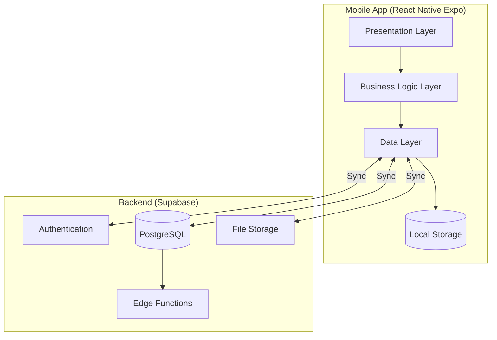
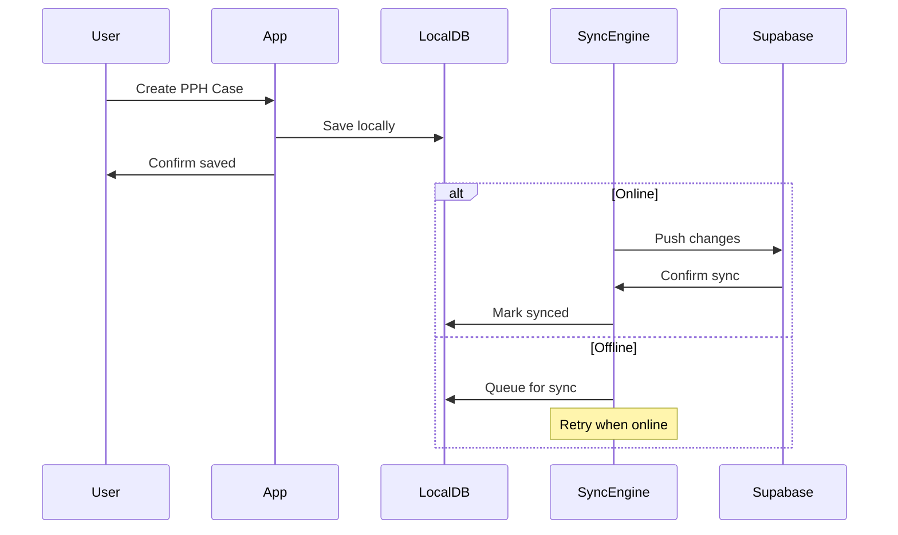

# MotivAid - System Architecture (React Native Expo)

## Overview

MotivAid uses a **component-based architecture** pattern with offline-first design, ensuring the app works reliably in low-connectivity environments.

---

## High-Level Architecture



---

## Layer Breakdown

### 1. Presentation Layer
| Component | Responsibility |
|-----------|----------------|
| Screens | Full-page views (Login, Dashboard, Clinical Mode) |
| Components | Reusable UI components |
| Hooks | Screen-level state management |

### 2. Business Logic Layer
| Component | Responsibility |
|-----------|----------------|
| Custom Hooks | Business logic encapsulation |
| Services | Cross-cutting concerns (sync, notifications) |
| Validators | Input validation and clinical rules |

### 3. Data Layer
| Component | Responsibility |
|-----------|----------------|
| API Services | Supabase API calls |
| Local Storage | AsyncStorage/SQLite operations |
| Sync Engine | Offline/online synchronization |

---

## Offline-First Architecture



---

## State Management (React Context + Zustand)

```
┌─────────────────────────────────────────────┐
│              Context Hierarchy              │
├─────────────────────────────────────────────┤
│  AuthContext         → User authentication  │
│  ├── UserContext     → Current user data    │
│  └── RoleContext     → Role permissions     │
│                                              │
│  ClinicalContext     → Clinical mode state  │
│  ├── TimerStore      → PPH monitoring timer │
│  ├── ChecklistStore  → E-MOTIVE steps       │
│  └── AlertStore      → Clinical alerts      │
│                                              │
│  SyncContext         → Sync status          │
│  └── QueueStore      → Pending operations   │
└─────────────────────────────────────────────┘
```

---

## Security Architecture

| Layer | Security Measure |
|-------|------------------|
| Transport | TLS 1.3 (HTTPS) |
| Storage | AES-256 encryption |
| Authentication | Supabase Auth + JWT |
| Authorization | Row-Level Security (RLS) |
| Data Isolation | Facility-based segmentation |

### RLS Policy Example
```sql
-- Users can only see cases from their facility
CREATE POLICY "Facility isolation" ON pph_cases
  FOR SELECT USING (
    facility_id = (
      SELECT facility_id FROM users WHERE id = auth.uid()
    )
  );
```

---

## Directory Structure

```
src/
├── App.js
├── app.json
│
├── components/              # Reusable UI components
│   ├── ui/                  # Basic UI elements
│   ├── common/              # Common components
│   └── forms/               # Form components
│
├── screens/                 # Feature screens
│   ├── auth/                # Authentication screens
│   ├── dashboard/           # Main dashboard screens
│   ├── clinical/            # Clinical mode screens
│   ├── training/            # Training mode screens
│   ├── reports/             # Reports & audits screens
│   └── settings/            # App settings screens
│
├── contexts/                # React Context providers
│   ├── AuthContext.js
│   ├── UserContext.js
│   └── ClinicalContext.js
│
├── hooks/                   # Custom React hooks
│   ├── useAuth.js
│   ├── useClinical.js
│   └── useSync.js
│
├── services/                # Business logic services
│   ├── api/
│   │   ├── authService.js
│   │   ├── clinicalService.js
│   │   └── syncService.js
│   ├── storage/
│   │   ├── localStorage.js
│   │   └── sqliteService.js
│   └── utils/
│       ├── validators.js
│       └── helpers.js
│
├── store/                   # Zustand stores
│   ├── authStore.js
│   ├── clinicalStore.js
│   └── syncStore.js
│
├── navigation/              # React Navigation setup
│   └── AppNavigator.js
│
├── constants/               # App constants
│   ├── apiConstants.js
│   ├── routes.js
│   └── theme.js
│
├── utils/                   # Utility functions
│   ├── formatters.js
│   ├── calculators.js
│   └── validators.js
│
└── assets/                  # Static assets
    ├── images/
    └── icons/
```

---

## Technology Decisions

| Decision | Choice | Rationale |
|----------|--------|-----------|
| Framework | React Native Expo | Cross-platform, single codebase, managed workflow |
| State Management | React Context + Zustand | Flexible, scalable, good for complex state |
| Local DB | SQLite + AsyncStorage | Fast offline, complex queries, simple key-value storage |
| Navigation | React Navigation | Standard for React Native, flexible routing |
| Backend | Supabase | Auth, DB, real-time, free tier |
| Sync Strategy | Custom queue-based | Reliable offline handling |
