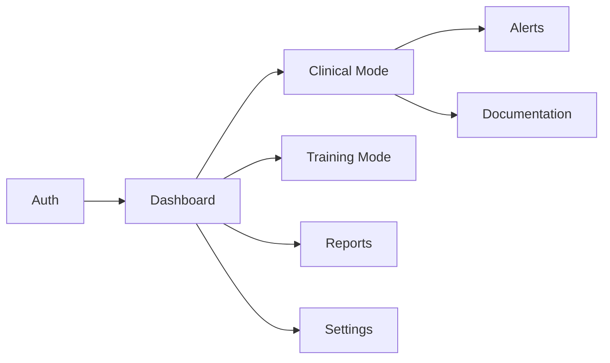

# MotivAid - Modules & Features

## Module Overview



---

## 1. Authentication Module

**Location:** `app/(auth)/`, `context/auth.tsx`, `lib/security.native.ts`

### Features

| Feature | Description | Priority | Status |
|---------|-------------|----------|--------|
| Online Login | Email/password via Supabase Auth | P0 | Done |
| Offline Login | SHA-256 hash verification against SecureStore | P0 | Done |
| Biometric Login | Fingerprint/Face ID via expo-local-authentication | P0 | Done |
| Registration | Self-registration with optional facility access code | P0 | Done |
| Forgot Password | Email-based password recovery | P0 | Done |
| Session Management | JWT token handling via SecureStore adapter | P0 | Done |

### Screens

| Screen | File | Purpose |
|--------|------|---------|
| Login | `app/(auth)/login.tsx` | Email/password + biometric sign-in |
| Register | `app/(auth)/register.tsx` | Self-registration with role selection |
| Forgot Password | `app/(auth)/forgot-password.tsx` | Password recovery request |
| Reset Password | `app/(auth)/reset-password.tsx` | Set new password |

### Key Components

- `AuthProvider` (`context/auth.tsx`) — Session state, profile caching, sign-in methods
- `ExpoSecureStoreAdapter` (`lib/supabase.ts`) — Encrypted token storage on native

---

## 2. Dashboard Module

**Location:** `app/(app)/(tabs)/index.tsx`

### Features

| Feature | Description | Priority | Status |
|---------|-------------|----------|--------|
| Role-Based View | Different dashboard per role | P0 | Done |
| Unit Selector | Global unit switching | P0 | Done |
| Offline Indicator | Network status badge | P0 | Done |
| Avatar Display | Profile picture with Supabase Storage | P1 | Done |
| Quick Actions | Role-specific action cards | P1 | Done |

### Dashboard Variants

| Role | Component | Content |
|------|-----------|---------|
| `admin` | `AdminDashboard` | Global statistics (facilities, staff, units, pending), quick action nav cards (Manage Facilities, All Staff, Audit Log, System Settings) |
| `supervisor` | `SupervisorDashboard` | Unit adherence metrics, pending approvals link, icon-based management grid (Units, Team, Analytics, Schedule, Reports, Settings, Identity Info) |
| `midwife` / `nurse` / `student` | `StaffDashboard` | Shift overview stats, icon-based quick actions (New Case, Training, My Patients, Schedule, Protocols, Reports), training progress bar |
| `user` (default) | `UserDashboard` | Simplified clinical mode entry |

---

## 3. Unit & Facility Module

**Location:** `context/unit.tsx`, `components/unit-selector.tsx`, `app/(app)/approvals.tsx`

### Features

| Feature | Description | Priority | Status |
|---------|-------------|----------|--------|
| Unit Selection | Switch active unit with modal picker | P0 | Done |
| Membership Approval | Supervisor approve/reject workflow | P0 | Done |
| Facility Codes | Role-specific registration codes | P0 | Done |
| Unit Persistence | Active unit saved to AsyncStorage | P0 | Done |

### Screens

| Screen | File | Purpose |
|--------|------|---------|
| Approvals | `app/(app)/approvals.tsx` | Supervisor reviews pending membership requests |
| Facilities | `app/(app)/facilities.tsx` | Admin/Supervisor creates, edits, deletes facilities, manages codes |
| Units | `app/(app)/units.tsx` | Admin/Supervisor creates, edits, deletes units within facilities |

### Key Components

- `UnitProvider` (`context/unit.tsx`) — Active unit state and available units
- `UnitSelector` (`components/unit-selector.tsx`) — Modal picker for unit switching

### Facility Code Management

| Feature | Description | Priority | Status |
|---------|-------------|----------|--------|
| Create Facility | Name, location, auto-generated codes | P0 | Done |
| Edit Facility | Update name, location | P1 | Done |
| Delete Facility | Remove facility and all related data | P1 | Done |
| View Codes | Modal showing all role codes for a facility | P0 | Done |
| Activate/Deactivate Codes | Toggle `is_active` flag with visual feedback | P0 | Done |
| Emergency Contacts | Manage 3-tier contact directory | P0 | Done |
| Code Format | Acronym-based (e.g., `AKTH1-SUP`) with unique suffix | P0 | Done |

---

## 4. Profile Module

**Location:** `app/(app)/profile.tsx`, `components/avatar.tsx`

### Features

| Feature | Description | Priority | Status |
|---------|-------------|----------|--------|
| View Profile | Display user info, email, role | P1 | Done |
| Edit Profile | Update username, full name, website | P1 | Done |
| Avatar Upload | Image picker + Supabase Storage upload | P1 | Done |

### Screens

| Screen | File | Purpose |
|--------|------|---------|
| Profile | `app/(app)/profile.tsx` | View and edit profile information |

---

## 5. Settings Module

**Location:** `app/(app)/(tabs)/settings.tsx`

### Features

| Feature | Description | Priority | Status |
|---------|-------------|----------|--------|
| Theme Selection | Light / Dark / System with persistence | P1 | Done |
| Profile Link | Navigate to profile editor | P1 | Done |
| Sign Out | Secure session termination | P0 | Done |
| Version Display | App version info | P2 | Done |

---

## 6. Clinical Mode Module — COMPLETE (Phase 4)

**Location:** `app/(app)/(tabs)/clinical.tsx`, `app/(app)/clinical/`, `context/clinical.tsx`, `lib/clinical-db.native.ts`

### Features

| Feature | Description | Priority | Status |
|---------|-------------|----------|--------|
| Risk Assessment | Maternal risk factor entry with 13 AWHONN-adapted factors | P0 | Done |
| Risk Profile | Auto-generated PPH risk level (Low/Medium/High/Critical) | P0 | Done |
| E-MOTIVE Checklist | Interactive 6-step clinical workflow with timer | P0 | Done |
| Vital Signs | HR, BP, temp, SpO2, RR with live shock index | P0 | Done |
| Blood Loss Tracking | Numeric input with quick-add buttons and method selector | P0 | Done |
| Timer | 60-minute elapsed timer anchored to first E-MOTIVE step | P0 | Done |
| Shock Index Alerts | 5-level severity with color banners and haptic alerts | P0 | Done |
| Case Lifecycle | Pre-Delivery → Active → Monitoring → Closed with outcomes | P0 | Done |
| Offline Clinical Data | SQLite (native) + localStorage (web) with full CRUD | P0 | Done |
| Sync Queue | Background upload with retry logic | P0 | Done |
| Case Timeline | Chronological event view with structured data logging | P0 | Done |
| Emergency Escalation | One-tap 3-tier emergency notification and calling | P0 | Done |
| Diagnostics Phase | Secondary PPH cause checklist (Retained placenta, Atony, etc.) | P0 | Done |
| Case Summary | Integrated overview of timeline, metrics, and clinical outcome | P1 | Done |
| Case Reports | Auto-generated PPH case summary (PDF) | P1 | Planned |

### Screens

| Screen | File | Purpose |
|--------|------|---------|
| Clinical Tab | `app/(app)/(tabs)/clinical.tsx` | Case list with status filters, search, supervisor cross-unit view |
| New Patient | `app/(app)/clinical/new-patient.tsx` | Maternal data entry with 13 risk factor toggles, live risk banner |
| Patient Detail | `app/(app)/clinical/patient-detail.tsx` | Patient overview, metrics cards, E-MOTIVE checklist, case lifecycle |
| Record Vitals | `app/(app)/clinical/record-vitals.tsx` | Quick-entry vitals pad with live shock index and blood loss estimation |
| Case Summary | `app/(app)/clinical/case-summary.tsx` | Integrated case review with timeline and metrics |
| Emergency Contacts | `app/(app)/management/emergency-contacts.tsx` | Manage facility and unit emergency contact lists |

### Key Components

| Component | File | Purpose |
|-----------|------|---------|
| `EmotiveChecklist` | `components/clinical/emotive-checklist.tsx` | Interactive E-MOTIVE bundle card with timer, accordion, dose fields |
| `VitalsPromptBanner` | `components/clinical/vitals-prompt-banner.tsx` | Animated reminder when vital signs are overdue |
| `CaseTimeline` | `components/clinical/case-timeline.tsx` | Chronological event list for the clinical case |
| `EscalationModal` | `components/clinical/escalation-modal.tsx` | Emergency contact directory with one-tap dialing |
| `DiagnosticsModal` | `components/clinical/diagnostics-modal.tsx` | Secondary PPH causes checklist |
| `ClinicalProvider` | `context/clinical.tsx` | Profiles, vitals, E-MOTIVE state, sync, timeline, and contacts |

### Clinical Logic Libraries

| Library | File | Purpose |
|---------|------|---------|
| Risk Calculator | `lib/risk-calculator.ts` | AWHONN-adapted scoring: 13 factors → Low/Medium/High/Critical |
| Shock Index | `lib/shock-index.ts` | SI = HR/SBP → 5 levels (Normal/Warning/Alert/Critical/Emergency) |
| Clinical DB (native) | `lib/clinical-db.native.ts` | SQLite tables + CRUD for profiles, vitals, checklists |
| Clinical DB (web) | `lib/clinical-db.ts` | localStorage fallback with identical API |
| Sync Queue | `lib/sync-queue.ts` | Background sync engine: local → Supabase with retry |

### E-MOTIVE Workflow

```
┌─────────────────────────────────────────────────────────────┐
│  E-MOTIVE BUNDLE                    ⏱ 12:34 / 60:00       │
│  Progress: ████████░░ 4/6                                    │
├─────────────────────────────────────────────────────────────┤
│  [✓] E  Early Detection           14:32                     │
│        └─ Notes: Blood loss observed at 500mL               │
│                                                              │
│  [✓] M  Uterine Massage           14:33                     │
│        └─ Notes: Bimanual compression applied               │
│                                                              │
│  [✓] O  Oxytocin                   14:35                     │
│        └─ Dose: 10 IU IV                                    │
│                                                              │
│  [✓] T  Tranexamic Acid            14:36                     │
│        └─ Dose: 1g IV                                       │
│                                                              │
│  [ ] I  IV Fluids                  (expanded, detail input) │
│        └─ Volume: _____ mL                                  │
│        └─ Notes: _____                                      │
│                                                              │
│  [ ] V/E Escalation                                         │
│                                                              │
├─────────────────────────────────────────────────────────────┤
│  [Complete All Steps → "Done" Button → Close Case Modal]    │
└─────────────────────────────────────────────────────────────┘
```

---

## 7. Training Module (Planned — Phase 6)

### Features

| Feature | Description | Priority | Status |
|---------|-------------|----------|--------|
| Scenarios | Simulated PPH cases | P1 | Planned |
| Quizzes | MCQ assessments | P1 | Planned |
| Case Studies | Interactive decision trees | P1 | Planned |
| Progress Tracking | Performance history | P2 | Planned |

---

## 8. Reports Module (Planned — Phase 5)

### Features

| Feature | Description | Priority | Status |
|---------|-------------|----------|--------|
| Case Reports | Individual PPH case summaries | P1 | Planned |
| Unit Reports | Aggregated metrics per unit | P1 | Planned |
| E-MOTIVE Adherence | Compliance tracking | P1 | Planned |
| Export | PDF/CSV generation | P2 | Planned |

---

## Shared Components

### UI Components

| Component | File | Usage |
|-----------|------|-------|
| `ThemedText` | `components/themed-text.tsx` | Theme-aware text with style variants |
| `ThemedView` | `components/themed-view.tsx` | Theme-aware view wrapper |
| `Avatar` | `components/avatar.tsx` | Avatar display + upload |
| `UnitSelector` | `components/unit-selector.tsx` | Unit switching modal |
| `IconSymbol` | `components/ui/icon-symbol.tsx` | Cross-platform icon (Ionicons / SF Symbols) |
| `HapticTab` | `components/haptic-tab.tsx` | Tab button with haptic feedback |
| `Button` | `components/ui/button.tsx` | Themed button with variants (primary, outline, secondary, ghost) |
| `Card` | `components/ui/card.tsx` | Themed card container |
| `Input` | `components/ui/input.tsx` | Themed text input with label, error, left/right icons |
| `ScreenContainer` | `components/ui/screen-container.tsx` | Page wrapper with safe area |
| `SectionHeader` | `components/ui/section-header.tsx` | Section title with optional action |
| `Skeleton` | `components/ui/skeleton.tsx` | Loading skeleton placeholder |

### Dashboard Components

| Component | File | Usage |
|-----------|------|-------|
| `ActionItem` | `components/dashboard/action-item.tsx` | Animated icon-based action card |
| `StatBox` | `components/dashboard/stat-box.tsx` | Compact stat display |
| `DashboardHeader` | `components/dashboard/dashboard-header.tsx` | Page header with avatar and greeting |
| `AwaitingAssignment` | `components/dashboard/awaiting-assignment.tsx` | Empty state for unassigned staff |

### Clinical Components

| Component | File | Usage |
|-----------|------|-------|
| `EmotiveChecklist` | `components/clinical/emotive-checklist.tsx` | Interactive E-MOTIVE bundle with timer, accordion, dose fields |
| `VitalsPromptBanner` | `components/clinical/vitals-prompt-banner.tsx` | Animated vitals reminder banner |

### Context Providers

| Provider | File | Responsibility |
|----------|------|----------------|
| `AuthProvider` | `context/auth.tsx` | Session, profile, sign-in/out |
| `ClinicalProvider` | `context/clinical.tsx` | Maternal profiles, vitals, E-MOTIVE, sync |
| `ThemeProvider` | `context/theme.tsx` | Light/dark/system theme |
| `ToastProvider` | `context/toast.tsx` | Animated notifications |
| `UnitProvider` | `context/unit.tsx` | Active unit selection |
