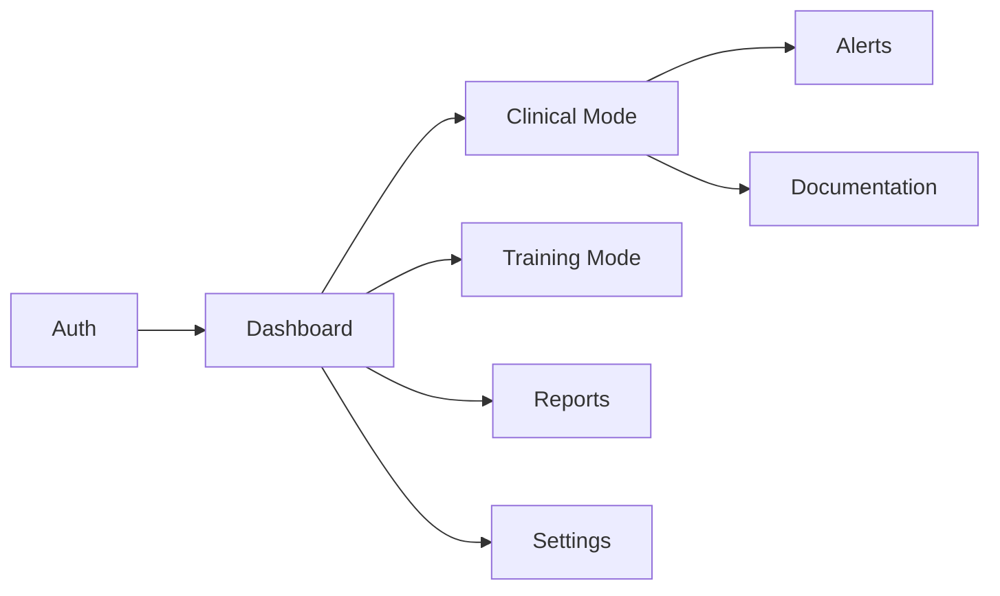

# MotivAid - Modules & Features

## Module Overview



---

## 1. Authentication Module

**Location:** `app/(auth)/`, `context/auth.tsx`, `lib/security.native.ts`

### Features

| Feature | Description | Priority | Status |
|---------|-------------|----------|--------|
| Online Login | Email/password via Supabase Auth | P0 | Done |
| Offline Login | SHA-256 hash verification against SecureStore | P0 | Done |
| Biometric Login | Fingerprint/Face ID via expo-local-authentication | P0 | Done |
| Registration | Self-registration with optional facility access code | P0 | Done |
| Forgot Password | Email-based password recovery | P0 | Done |
| Session Management | JWT token handling via SecureStore adapter | P0 | Done |

### Screens

| Screen | File | Purpose |
|--------|------|---------|
| Login | `app/(auth)/login.tsx` | Email/password + biometric sign-in |
| Register | `app/(auth)/register.tsx` | Self-registration with role selection |
| Forgot Password | `app/(auth)/forgot-password.tsx` | Password recovery request |
| Reset Password | `app/(auth)/reset-password.tsx` | Set new password |

### Key Components

- `AuthProvider` (`context/auth.tsx`) — Session state, profile caching, sign-in methods
- `ExpoSecureStoreAdapter` (`lib/supabase.ts`) — Encrypted token storage on native

---

## 2. Dashboard Module

**Location:** `app/(app)/(tabs)/index.tsx`

### Features

| Feature | Description | Priority | Status |
|---------|-------------|----------|--------|
| Role-Based View | Different dashboard per role | P0 | Done |
| Unit Selector | Global unit switching | P0 | Done |
| Offline Indicator | Network status badge | P0 | Done |
| Avatar Display | Profile picture with Supabase Storage | P1 | Done |
| Quick Actions | Role-specific action cards | P1 | Done |

### Dashboard Variants

| Role | Component | Content |
|------|-----------|---------|
| `admin` | `AdminDashboard` | Global statistics, system admin actions (Security, Config, Audit Logs) |
| `supervisor` | `SupervisorDashboard` | Unit adherence metrics, pending approvals link, management actions |
| `midwife` / `nurse` / `student` | `StaffDashboard` | Shift overview stats, Clinical Mode + Training + History actions, training progress bar |
| `user` (default) | `UserDashboard` | Simplified clinical mode entry |

---

## 3. Unit & Facility Module

**Location:** `context/unit.tsx`, `components/unit-selector.tsx`, `app/(app)/approvals.tsx`

### Features

| Feature | Description | Priority | Status |
|---------|-------------|----------|--------|
| Unit Selection | Switch active unit with modal picker | P0 | Done |
| Membership Approval | Supervisor approve/reject workflow | P0 | Done |
| Facility Codes | Role-specific registration codes | P0 | Done |
| Unit Persistence | Active unit saved to AsyncStorage | P0 | Done |

### Screens

| Screen | File | Purpose |
|--------|------|---------|
| Approvals | `app/(app)/approvals.tsx` | Supervisor reviews pending membership requests |

### Key Components

- `UnitProvider` (`context/unit.tsx`) — Active unit state and available units
- `UnitSelector` (`components/unit-selector.tsx`) — Modal picker for unit switching

---

## 4. Profile Module

**Location:** `app/(app)/profile.tsx`, `components/avatar.tsx`

### Features

| Feature | Description | Priority | Status |
|---------|-------------|----------|--------|
| View Profile | Display user info, email, role | P1 | Done |
| Edit Profile | Update username, full name, website | P1 | Done |
| Avatar Upload | Image picker + Supabase Storage upload | P1 | Done |

### Screens

| Screen | File | Purpose |
|--------|------|---------|
| Profile | `app/(app)/profile.tsx` | View and edit profile information |

---

## 5. Settings Module

**Location:** `app/(app)/(tabs)/settings.tsx`

### Features

| Feature | Description | Priority | Status |
|---------|-------------|----------|--------|
| Theme Selection | Light / Dark / System with persistence | P1 | Done |
| Profile Link | Navigate to profile editor | P1 | Done |
| Sign Out | Secure session termination | P0 | Done |
| Version Display | App version info | P2 | Done |

---

## 6. Clinical Mode Module (Planned — Phase 3-4)

### Features

| Feature | Description | Priority | Status |
|---------|-------------|----------|--------|
| Risk Assessment | Maternal risk factor entry form | P0 | Planned |
| Risk Profile | Auto-generated PPH risk level | P0 | Planned |
| E-MOTIVE Checklist | Step-by-step clinical workflow | P0 | Planned |
| Vital Signs | HR, BP, shock index calculation | P0 | Planned |
| Blood Loss Tracking | Visual estimation guides | P0 | Planned |
| Timer | PPH monitoring countdown (1 hour) | P0 | Planned |
| Alerts | Threshold-based warnings | P0 | Planned |
| Escalation | One-tap emergency notification | P0 | Planned |
| Documentation | Automatic event logging | P0 | Planned |

### E-MOTIVE Workflow

```
┌─────────────────────────────────────────────┐
│  E-MOTIVE CHECKLIST                         │
├─────────────────────────────────────────────┤
│  [ ] Early Detection                        │
│      └─ Blood loss estimation               │
│      └─ Vital signs check                   │
│                                              │
│  [ ] Massage (Uterine)                      │
│      └─ Bimanual compression                │
│                                              │
│  [ ] Oxytocics                              │
│      └─ Oxytocin (10 IU IM/IV)             │
│      └─ Alternative: Misoprostol           │
│                                              │
│  [ ] Tranexamic Acid                        │
│      └─ 1g IV within 3 hours               │
│                                              │
│  [ ] IV Fluids                              │
│      └─ Crystalloids (Ringer's/NS)         │
│                                              │
│  [ ] Examination                            │
│      └─ Inspect for tears                  │
│      └─ Check for retained products        │
│                                              │
│  [ ] Escalation                             │
│      └─ Call for help                      │
│      └─ Prepare referral                   │
└─────────────────────────────────────────────┘
```

---

## 7. Training Module (Planned — Phase 6)

### Features

| Feature | Description | Priority | Status |
|---------|-------------|----------|--------|
| Scenarios | Simulated PPH cases | P1 | Planned |
| Quizzes | MCQ assessments | P1 | Planned |
| Case Studies | Interactive decision trees | P1 | Planned |
| Progress Tracking | Performance history | P2 | Planned |

---

## 8. Reports Module (Planned — Phase 5)

### Features

| Feature | Description | Priority | Status |
|---------|-------------|----------|--------|
| Case Reports | Individual PPH case summaries | P1 | Planned |
| Unit Reports | Aggregated metrics per unit | P1 | Planned |
| E-MOTIVE Adherence | Compliance tracking | P1 | Planned |
| Export | PDF/CSV generation | P2 | Planned |

---

## Shared Components

### UI Components

| Component | File | Usage |
|-----------|------|-------|
| `ThemedText` | `components/themed-text.tsx` | Theme-aware text with style variants |
| `ThemedView` | `components/themed-view.tsx` | Theme-aware view wrapper |
| `Avatar` | `components/avatar.tsx` | Avatar display + upload |
| `UnitSelector` | `components/unit-selector.tsx` | Unit switching modal |
| `IconSymbol` | `components/ui/icon-symbol.tsx` | Cross-platform icon (Ionicons / SF Symbols) |
| `HapticTab` | `components/haptic-tab.tsx` | Tab button with haptic feedback |
| `Collapsible` | `components/ui/collapsible.tsx` | Expandable section |
| `ExternalLink` | `components/external-link.tsx` | In-app browser link |
| `ParallaxScrollView` | `components/parallax-scroll-view.tsx` | Parallax header scroll |

### Context Providers

| Provider | File | Responsibility |
|----------|------|----------------|
| `AuthProvider` | `context/auth.tsx` | Session, profile, sign-in/out |
| `ThemeProvider` | `context/theme.tsx` | Light/dark/system theme |
| `ToastProvider` | `context/toast.tsx` | Animated notifications |
| `UnitProvider` | `context/unit.tsx` | Active unit selection |
