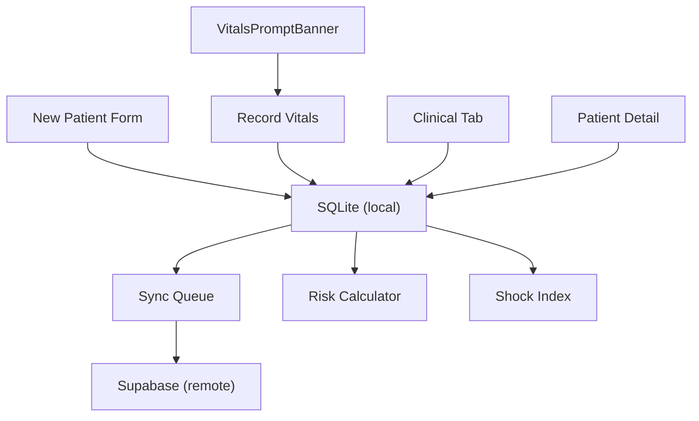

# Phase 3: Risk Assessment & Clinical Data — Walkthrough

## Overview

Implemented the complete clinical data module for MotivAid: offline-first maternal profile management, AWHONN-based PPH risk assessment, real-time shock index monitoring, vital signs tracking, and auto-prompting.

---

## Architecture

## Files Created

### Database
| File | Purpose |
|------|---------|
| [20260220000000_clinical_data_tables.sql](file:///c:/Users/abdul/flutterProj/MotivAid/supabase/migrations/20260220000000_clinical_data_tables.sql) | Migration: `maternal_profiles`, `vital_signs`, `sync_queue` + RLS |

### Core Logic
| File | Purpose |
|------|---------|
| [risk-calculator.ts](file:///c:/Users/abdul/flutterProj/MotivAid/lib/risk-calculator.ts) | AWHONN-adapted scoring (Low/Medium/High), auto-escalation |
| [shock-index.ts](file:///c:/Users/abdul/flutterProj/MotivAid/lib/shock-index.ts) | 5 severity levels + haptic feedback + blood loss assessment |
| [clinical-db.native.ts](file:///c:/Users/abdul/flutterProj/MotivAid/lib/clinical-db.native.ts) | SQLite CRUD for offline data |
| [clinical-db.ts](file:///c:/Users/abdul/flutterProj/MotivAid/lib/clinical-db.ts) | Web stubs |
| [sync-queue.ts](file:///c:/Users/abdul/flutterProj/MotivAid/lib/sync-queue.ts) | Network-aware sync engine |

### Context, Screens & Components
| File | Purpose |
|------|---------|
| [context/clinical.tsx](file:///c:/Users/abdul/flutterProj/MotivAid/context/clinical.tsx) | Workflow state: profiles, vitals, auto-prompt timer, sync |
| [clinical.tsx](file:///c:/Users/abdul/flutterProj/MotivAid/app/(app)/(tabs)/clinical.tsx) | Case list with risk badges, status filters, sync |
| [new-patient.tsx](file:///c:/Users/abdul/flutterProj/MotivAid/app/(app)/clinical/new-patient.tsx) | Profile form + **live risk banner** |
| [patient-detail.tsx](file:///c:/Users/abdul/flutterProj/MotivAid/app/(app)/clinical/patient-detail.tsx) | Risk card, SI/blood loss metrics, vitals timeline |
| [record-vitals.tsx](file:///c:/Users/abdul/flutterProj/MotivAid/app/(app)/clinical/record-vitals.tsx) | Vital inputs + **live animated shock index** |
| [vitals-prompt-banner.tsx](file:///c:/Users/abdul/flutterProj/MotivAid/components/clinical/vitals-prompt-banner.tsx) | Auto-prompt slide-in notification |

### Modified Files
| File | Change |
|------|--------|
| [app/_layout.tsx](file:///c:/Users/abdul/flutterProj/MotivAid/app/_layout.tsx) | Added `ClinicalProvider` |
| [app/(app)/(tabs)/_layout.tsx](file:///c:/Users/abdul/flutterProj/MotivAid/app/(app)/(tabs)/_layout.tsx) | Added Clinical tab |
| [app/(app)/_layout.tsx](file:///c:/Users/abdul/flutterProj/MotivAid/app/(app)/_layout.tsx) | Added clinical routes |
| [icon-symbol.tsx](file:///c:/Users/abdul/flutterProj/MotivAid/components/ui/icon-symbol.tsx) | Added `cross.case.fill` mapping |
| [staff-dashboard.tsx](file:///c:/Users/abdul/flutterProj/MotivAid/components/dashboard/staff-dashboard.tsx) | Wired New Case, My Patients, View All |
| [supervisor-dashboard.tsx](file:///c:/Users/abdul/flutterProj/MotivAid/components/dashboard/supervisor-dashboard.tsx) | Added Cases action |

---

## Key Features

- **Live Risk Calculation** — Risk banner updates instantly as AWHONN factors are toggled
- **Live Shock Index** — Animated pulse + haptic feedback at critical/emergency thresholds
- **Blood Loss Quick-Buttons** — +100/+250/+500/+1000 mL with method selector (Visual/Drape/Weighed)
- **Auto-Prompt Timer** — Configurable interval (default 15min), slide-in banner with haptic
- **Offline-First** — All writes to SQLite → sync queue → Supabase when online

## Known Lint Notes

Expo Router typed-route lint errors (`"/(app)/clinical/..."` not assignable) are expected — they auto-resolve when the dev server regenerates `.expo/types` on next run.
