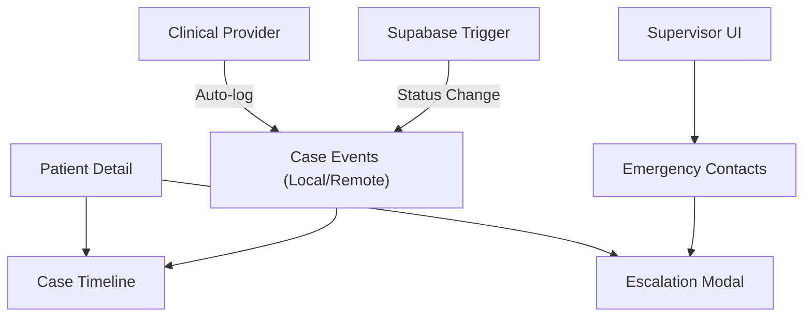

# Phase 4: Timeline, Alerts & Escalation — Walkthrough

## Overview

Phase 4 transformed MotivAid from a clinical data entry tool into a coordinated emergency response system. This phase implemented a unified chronological timeline for patient care, a tiered emergency escalation system, and administrative tools for managing emergency contacts.

---

## Architecture

## Files Created & Modified

### Database & Sync
| File | Purpose |
|------|---------|
| `supabase/migrations/20260224000000_emergency_and_timeline.sql` | Migration: `emergency_contacts`, `case_events`, `audit_logs` + RLS + Logging Trigger |
| `lib/clinical-db.native.ts` | SQLite CRUD for events and contacts (Native) |
| `lib/clinical-db.ts` | localStorage CRUD stubs for events and contacts (Web) |
| `lib/sync-queue.ts` | Updated sync engine to support `case_events` |

### Core Logic & Context
| File | Purpose |
|------|---------|
| `context/clinical.tsx` | Expanded to manage `caseEvents` and `emergencyContacts` state with auto-logging logic |

### UI Components
| File | Purpose |
|------|---------|
| `components/clinical/case-timeline.tsx` | Vertical feed of clinical events with type-specific icons and colors |
| `components/clinical/escalation-modal.tsx` | Tiered emergency contact list (Unit/Facility/Referral) with one-tap dialing |

### Screens & Navigation
| File | Purpose |
|------|---------|
| `app/(app)/clinical/patient-detail.tsx` | Integrated timeline feed and high-visibility "Emergency" button |
| `app/(app)/management/emergency-contacts.tsx` | Management interface for Supervisors to maintain contacts |
| `components/dashboard/supervisor-dashboard.tsx` | Added "Emerg. Contacts" quick action |
| `components/dashboard/admin-dashboard.tsx` | Added "Emerg. Contacts" quick action |
| `app/(app)/_layout.tsx` | Registered new management routes |

---

## Key Features

### 1. Unified Case Timeline
Replaced the static vitals list with a rich, chronological "Story of the Case."
- **Automatic Event Generation:** Events are logged automatically when vitals are recorded, E-MOTIVE steps are toggled, or case status changes.
- **Manual Logging:** Basic events like "Viewed patient detail" are logged to track clinical attention.
- **Visual Indicators:** Pulse icons for vitals, medical icons for bundle steps, and alert icons for escalations.

### 2. Tiered Escalation System
A 3-level hierarchy designed for rapid response:
- **Tier 1 (Unit):** Immediate bedside assistance (e.g., Senior Midwife).
- **Tier 2 (Facility):** Specialists and resources (e.g., Blood Bank, Theatre).
- **Tier 3 (External):** External centers and ambulance services.
- **Actionable:** Initiates native phone calls directly from the app and logs the call event to the timeline.

### 3. Contact Management
Supervisors and Admins can now manage the "Facility Phone Book" directly within the app, ensuring that emergency information is always up to date and scoped to the correct facility.

### 4. System Audit
The foundation for clinical accountability has been laid with the `audit_logs` table, which tracks major administrative and clinical actions across the system.

---

## Technical Improvements
- **Hoisting Resolution:** Fixed a critical `ReferenceError` by reordering `useCallback` and `useEffect` hooks in the `ClinicalProvider`.
- **Web Parity:** Fully implemented web stubs in `lib/clinical-db.ts` to ensure the management interface works for desktop administrators.
- **Sync Reliability:** Enhanced the sync queue to handle nested foreign key relationships (Events → Patients).

---

*Phase 4 ensures that every action taken in a crisis is documented and that help is never more than one tap away.*
