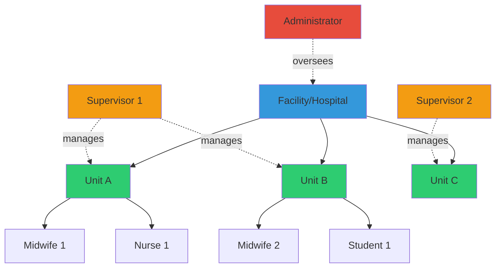
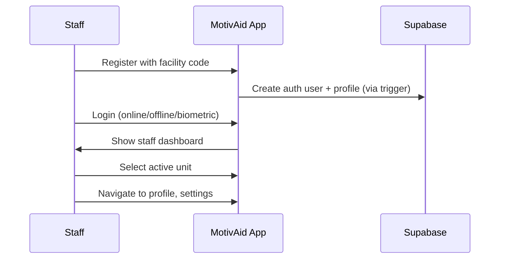
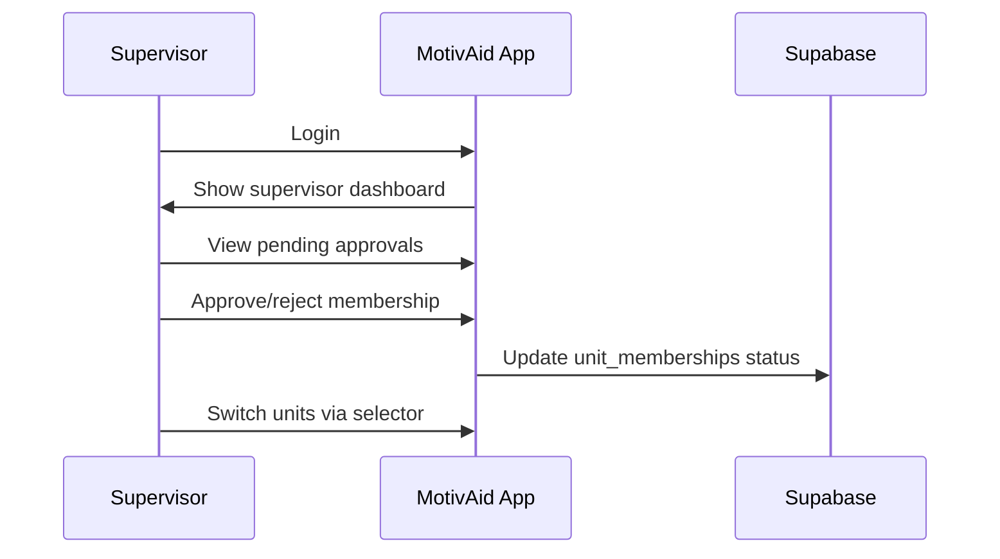

# MotivAid - System Description

## System Overview

**MotivAid** is a mobile health application built with **React Native** (Expo SDK 54) designed to support midwives and frontline healthcare workers in the early detection, prevention, and management of postpartum hemorrhage (PPH) using the WHO-endorsed E-MOTIVE clinical bundle. The system is organized around **facilities** and **units**, enabling hierarchical management and oversight.

---

## Organizational Structure



### Key Concepts

| Concept | Description |
|---------|-------------|
| **Facility** | A healthcare institution (e.g., General Hospital, Primary Health Center) |
| **Unit** | A subdivision within a facility (e.g., Maternity Ward A, Emergency Delivery Unit) |
| **User Roles** | Admin, Supervisor, Midwife, Nurse, Student, User |
| **Membership** | Users can belong to multiple units; memberships require supervisor approval |
| **Facility Codes** | Role-specific 6-character codes used during registration to assign roles |

---

## User Roles & Responsibilities

### 1. Midwife / Nurse / Student (Frontline Staff)

**Primary Function:** Direct patient care and PPH management

**Capabilities:**
- Register with a facility access code to get role assignment
- Join units within their facility (requires supervisor approval)
- Access role-based staff dashboard with shift overview
- Access clinical mode for PPH management (planned)
- Complete E-MOTIVE checklists during deliveries (planned)
- Access training and simulation modules (planned)
- Switch between units if member of multiple

**Current Workflow:**


---

### 2. Supervisor (Unit Manager)

**Primary Function:** Unit oversight, quality assurance, and team management

**Capabilities:**
- All staff capabilities
- View unit adherence metrics on supervisor dashboard
- Approve or reject pending unit membership requests
- Manage team members across their units
- Access analytics and unit-level reports (planned)

**Current Workflow:**


---

### 3. Administrator (System Manager)

**Primary Function:** System-wide configuration and cross-facility management

**Capabilities:**
- Global statistics view on admin dashboard
- System administration actions (security, config, audit logs)
- Access to all facilities and units (planned via Next.js web panel)

> Administrator panel will be implemented separately using Next.js for web-based management.

---

## Core Workflows

### Workflow 1: User Registration

```
┌──────────────────────────────────────────────────────────┐
│ STEP 1: Registration                                      │
├──────────────────────────────────────────────────────────┤
│ User fills out:                                           │
│   - Full name, email, password                            │
│   - Optionally toggles "Medical Staff" mode               │
│     - Selects role: Midwife / Nurse / Student / Supervisor│
│     - Enters 6-character facility access code             │
│     - Code validated in real-time against facility_codes  │
│ Submits registration via supabase.auth.signUp()           │
└──────────────────────────────────────────────────────────┘
                        ↓
┌──────────────────────────────────────────────────────────┐
│ STEP 2: Profile Creation (Automatic)                      │
├──────────────────────────────────────────────────────────┤
│ Database trigger handle_new_user() fires:                 │
│   - Reads registration_code from user metadata            │
│   - Looks up code in facility_codes table                 │
│   - Assigns matching role (or defaults to 'user')         │
│   - Creates profiles row with id, full_name, role         │
└──────────────────────────────────────────────────────────┘
                        ↓
┌──────────────────────────────────────────────────────────┐
│ STEP 3: Unit Membership (Post-Login)                      │
├──────────────────────────────────────────────────────────┤
│ Staff can request to join units within their facility     │
│ Creates unit_memberships row with status = 'pending'      │
│ Supervisor reviews and approves/rejects                   │
└──────────────────────────────────────────────────────────┘
```

### Workflow 2: Authentication

```
┌──────────────────────────────────────────────────────────┐
│ PATH A: Online Sign-In                                    │
├──────────────────────────────────────────────────────────┤
│ 1. Check network via NetInfo                              │
│ 2. supabase.auth.signInWithPassword(email, password)     │
│ 3. Save SHA-256(email + password) hash to SecureStore    │
│ 4. Fetch profile from Supabase, cache to SQLite          │
│ 5. Set isOfflineAuthenticated = true                      │
└──────────────────────────────────────────────────────────┘

┌──────────────────────────────────────────────────────────┐
│ PATH B: Offline Sign-In                                   │
├──────────────────────────────────────────────────────────┤
│ 1. Hash entered credentials with SHA-256                  │
│ 2. Compare against hash stored in SecureStore            │
│ 3. Load cached profile from SQLite                        │
│ 4. Set isOfflineAuthenticated = true                      │
└──────────────────────────────────────────────────────────┘

┌──────────────────────────────────────────────────────────┐
│ PATH C: Biometric Sign-In                                 │
├──────────────────────────────────────────────────────────┤
│ 1. expo-local-authentication prompt                       │
│ 2. On success, load most recent cached profile from SQLite│
│ 3. Set isOfflineAuthenticated = true                      │
└──────────────────────────────────────────────────────────┘
```

### Workflow 3: Clinical Mode (Planned — Phase 3-4)

```
┌──────────────────────────────────────────────────────────┐
│ STEP 1: Pre-Delivery Preparation                          │
├──────────────────────────────────────────────────────────┤
│ Midwife selects active unit                               │
│ Navigates to Clinical Mode                                │
│ Enters maternal risk factors (age, parity, history)       │
│ System calculates risk profile                            │
│ Displays preparedness recommendations                     │
└──────────────────────────────────────────────────────────┘
                        ↓
┌──────────────────────────────────────────────────────────┐
│ STEP 2: Delivery & Monitoring                             │
├──────────────────────────────────────────────────────────┤
│ Record delivery time                                      │
│ PPH monitoring timer starts (1 hour)                      │
│ Record initial vital signs                                │
│ Estimate blood loss                                       │
└──────────────────────────────────────────────────────────┘
                        ↓
┌──────────────────────────────────────────────────────────┐
│ STEP 3: E-MOTIVE Checklist (If PPH Detected)             │
├──────────────────────────────────────────────────────────┤
│ [ ] Early Detection (blood loss >500ml OR clinical signs) │
│ [ ] Massage (uterine massage)                             │
│ [ ] Oxytocics (Oxytocin/Misoprostol)                     │
│ [ ] Tranexamic Acid (within 3 hours)                      │
│ [ ] IV Fluids                                             │
│ [ ] Examination (source identification)                   │
│ [ ] Escalation (if not improving)                         │
└──────────────────────────────────────────────────────────┘
                        ↓
┌──────────────────────────────────────────────────────────┐
│ STEP 4: Documentation & Case Closure                      │
├──────────────────────────────────────────────────────────┤
│ System automatically logs all interventions               │
│ Record final outcome (resolved/referred/death)            │
│ Case report generated for audit                           │
└──────────────────────────────────────────────────────────┘
```

---

## Data Flow & Architecture

### System Architecture

```
┌─────────────────────────────────────────────────────────────┐
│                React Native Expo App                         │
│               (Offline-First Design)                         │
├─────────────────────────────────────────────────────────────┤
│  UI Layer          │ Expo Router v6 (file-based routing)    │
│  State Layer       │ React Context (4 providers)            │
│  Service Layer     │ lib/ (platform-specific modules)       │
│  Local Storage     │ SQLite + SecureStore + AsyncStorage    │
└─────────────────────────────────────────────────────────────┘
                          ↕ (Sync when online)
┌─────────────────────────────────────────────────────────────┐
│                     Supabase Backend                         │
│                      (PostgreSQL)                            │
├─────────────────────────────────────────────────────────────┤
│  Authentication    │ Supabase Auth (JWT + SecureStore)      │
│  Database          │ PostgreSQL with RLS                    │
│  Storage           │ File storage (avatars)                 │
│  Edge Functions    │ Planned (risk calc, reports)           │
└─────────────────────────────────────────────────────────────┘
```

### Multi-Unit Data Isolation

**Row-Level Security (RLS) ensures:**
- Staff only see data from their assigned units (via approved `unit_memberships`)
- Supervisors see data from units they manage
- Administrators have unrestricted access
- Facility and unit metadata is publicly readable
- Facility codes are publicly readable for registration validation

---

## Emergency Escalation System (Planned — Phase 5)

### Escalation Hierarchy

```
┌─────────────────────────────────────────────────┐
│ LEVEL 1: Unit Emergency Contacts                │
│ - Senior midwife on duty                        │
│ - Unit supervisor                               │
└─────────────────────────────────────────────────┘
                    ↓ (if no response)
┌─────────────────────────────────────────────────┐
│ LEVEL 2: Facility Emergency Contacts            │
│ - Obstetrician on call                          │
│ - Anesthetist                                   │
│ - Facility administrator                        │
└─────────────────────────────────────────────────┘
                    ↓ (if critical)
┌─────────────────────────────────────────────────┐
│ LEVEL 3: External Referral                      │
│ - Referral hospital contacts                    │
│ - Ambulance services                            │
└─────────────────────────────────────────────────┘
```

**Trigger Mechanisms (Planned):**
- One-tap emergency button in clinical mode
- Automatic alerts based on thresholds (blood loss >1000ml, shock index >1.4)
- Manual escalation by midwife/supervisor

---

## Offline Capability

> MotivAid works fully offline to ensure reliability in low-connectivity environments.

### Current Offline Features
- Offline sign-in (credential hash verification)
- Biometric sign-in (no network needed)
- Cached profile display from SQLite
- Theme and unit selection persistence via AsyncStorage

### Planned Offline Features
- Complete clinical workflow (data saved to SQLite)
- E-MOTIVE checklist and vital signs entry
- Case creation and management
- Training modules
- Automatic sync queue when connectivity restores

---

## Security & Privacy

### Data Protection

| Layer | Mechanism |
|-------|-----------|
| Transport | TLS 1.3 (HTTPS) |
| Auth Tokens | SecureStore encryption (native) |
| Credentials | SHA-256 hashed, never stored in plain text |
| Authentication | Supabase Auth + JWT tokens |
| Authorization | Row-Level Security (RLS) policies |
| Session | Auto-refresh tokens via Supabase client |

### Privacy Principles
- Patient data will be anonymized (optional patient IDs)
- User data is facility/unit-scoped via RLS
- Supervisors cannot access other supervisors' units (unless explicitly assigned)
- All actions are tracked for audit purposes (planned)

---

## Technical Requirements

### Minimum Device Specifications
- **OS:** Android 8.0+ / iOS 15+
- **RAM:** 2GB minimum
- **Storage:** 500MB available

### Supported Platforms
- **Android** — Primary target
- **iOS** — Supported via Expo managed workflow
- **Web** — Supported with localStorage fallbacks (no SQLite, no biometrics)
