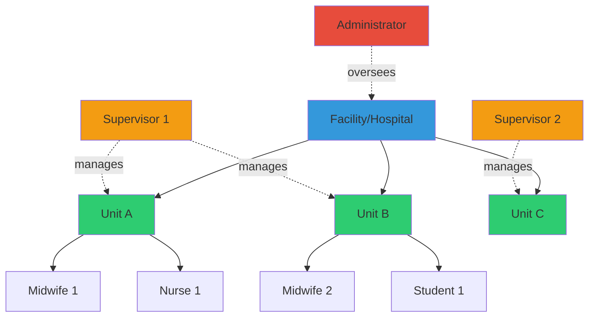
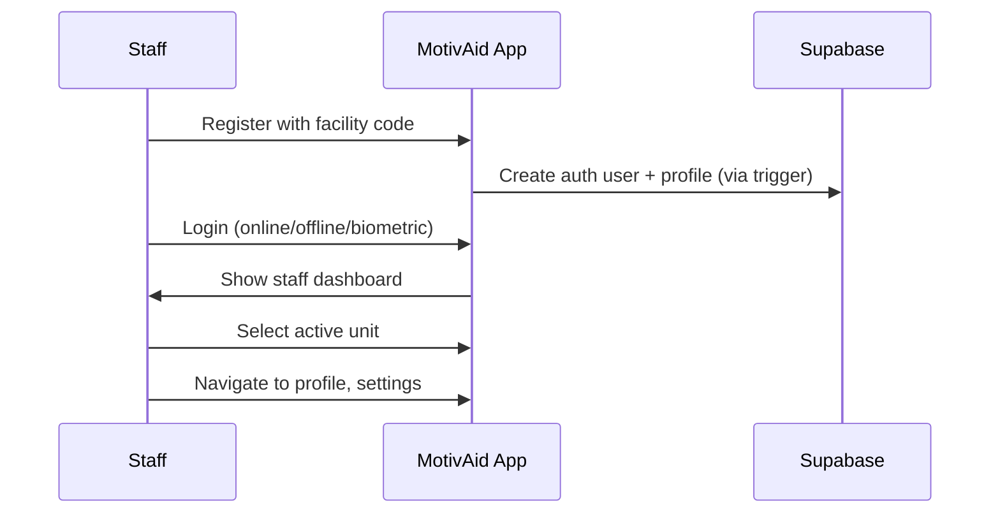
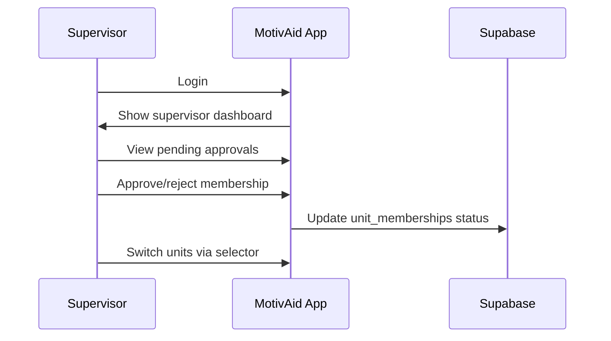

# MotivAid - System Description

## System Overview

**MotivAid** is a mobile health application built with **React Native** (Expo SDK 54) designed to support midwives and frontline healthcare workers in the early detection, prevention, and management of postpartum hemorrhage (PPH) using the WHO-endorsed E-MOTIVE clinical bundle. The system is organized around **facilities** and **units**, enabling hierarchical management and oversight.

---

## Organizational Structure



### Key Concepts

| Concept | Description |
|---------|-------------|
| **Facility** | A healthcare institution (e.g., General Hospital, Primary Health Center) |
| **Unit** | A subdivision within a facility (e.g., Maternity Ward A, Emergency Delivery Unit) |
| **User Roles** | Admin, Supervisor, Midwife, Nurse, Student, User |
| **Membership** | Users can belong to multiple units; memberships require supervisor approval |
| **Facility Codes** | Role-specific codes (e.g., `AKTH1-SUP`) used during registration to assign roles. Can be activated/deactivated. |

---

## User Roles & Responsibilities

### 1. Midwife / Nurse / Student (Frontline Staff)

**Primary Function:** Direct patient care and PPH management

**Capabilities:**
- Register with a facility access code to get role assignment
- Join units within their facility (requires supervisor approval)
- Access role-based staff dashboard with shift overview
- Access clinical mode for PPH management
- Create maternal profiles with risk assessment
- Record vital signs with live Shock Index calculation
- Complete interactive E-MOTIVE checklists with timer
- Manage case lifecycle (Pre-Delivery → Active → Monitoring → Closed)
- Access training and simulation modules (planned)
- Switch between units if member of multiple

**Current Workflow:**


---

### 2. Supervisor (Unit Manager)

**Primary Function:** Unit oversight, quality assurance, and team management

**Capabilities:**
- All staff capabilities
- View unit adherence metrics on supervisor dashboard
- Approve or reject pending unit membership requests
- Manage team members across their units
- Access analytics and unit-level reports (planned)

**Current Workflow:**


---

### 3. Administrator (System Manager)

**Primary Function:** System-wide configuration and cross-facility management

**Capabilities:**
- Global statistics view on admin dashboard (facilities, staff, units, pending)
- Manage facilities: create, edit, delete facilities
- Manage registration codes: auto-generate, activate, deactivate
- Manage units: create, edit, delete units within facilities
- Quick action navigation cards for system management
- Access to all facilities and units

---

## Core Workflows

### Workflow 1: User Registration

```
┌──────────────────────────────────────────────────────────┐
│ STEP 1: Registration                                      │
├──────────────────────────────────────────────────────────┤
│ User fills out:                                           │
│   - Full name, email, password                            │
│   - Optionally toggles "Medical Staff" mode               │
│     - Selects role: Midwife / Nurse / Student / Supervisor│
│     - Enters facility access code (e.g., AKTH1-SUP)      │
│     - Code validated in real-time (debounced, 4+ chars)  │
│     - Deactivated codes show specific error message       │
│ Submits registration via supabase.auth.signUp()           │
└──────────────────────────────────────────────────────────┘
                        ↓
┌──────────────────────────────────────────────────────────┐
│ STEP 2: Profile Creation (Automatic)                      │
├──────────────────────────────────────────────────────────┤
│ Database trigger handle_new_user() fires:                 │
│   - Reads registration_code from user metadata            │
│   - Looks up code in facility_codes table                 │
│   - Assigns matching role (or defaults to 'user')         │
│   - Creates profiles row with id, full_name, role         │
└──────────────────────────────────────────────────────────┘
                        ↓
┌──────────────────────────────────────────────────────────┐
│ STEP 3: Unit Membership (Post-Login)                      │
├──────────────────────────────────────────────────────────┤
│ Staff can request to join units within their facility     │
│ Creates unit_memberships row with status = 'pending'      │
│ Supervisor reviews and approves/rejects                   │
└──────────────────────────────────────────────────────────┘
```

### Workflow 2: Authentication

```
┌──────────────────────────────────────────────────────────┐
│ PATH A: Online Sign-In                                    │
├──────────────────────────────────────────────────────────┤
│ 1. Check network via NetInfo                              │
│ 2. supabase.auth.signInWithPassword(email, password)     │
│ 3. Save SHA-256(email + password) hash to SecureStore    │
│ 4. Fetch profile from Supabase, cache to SQLite          │
│ 5. Set isOfflineAuthenticated = true                      │
└──────────────────────────────────────────────────────────┘

┌──────────────────────────────────────────────────────────┐
│ PATH B: Offline Sign-In                                   │
├──────────────────────────────────────────────────────────┤
│ 1. Hash entered credentials with SHA-256                  │
│ 2. Compare against hash stored in SecureStore            │
│ 3. Load cached profile from SQLite                        │
│ 4. Set isOfflineAuthenticated = true                      │
└──────────────────────────────────────────────────────────┘

┌──────────────────────────────────────────────────────────┐
│ PATH C: Biometric Sign-In                                 │
├──────────────────────────────────────────────────────────┤
│ 1. expo-local-authentication prompt                       │
│ 2. On success, load most recent cached profile from SQLite│
│ 3. Set isOfflineAuthenticated = true                      │
└──────────────────────────────────────────────────────────┘
```

### Workflow 3: Clinical Mode — IMPLEMENTED (Phase 3)

```
┌──────────────────────────────────────────────────────────┐
│ STEP 1: Pre-Delivery Preparation                          │
├──────────────────────────────────────────────────────────┤
│ Midwife navigates to Clinical tab → taps "New"           │
│ Enters maternal data: age, gravida, parity, risk factors │
│ System calculates risk level (Low/Medium/High/Critical)  │
│ Live risk banner updates as toggles change               │
│ Saves profile locally → queues sync to Supabase          │
│ Case appears in Clinical tab case list                    │
└──────────────────────────────────────────────────────────┘
                        ↓
┌──────────────────────────────────────────────────────────┐
│ STEP 2: Active Monitoring                                 │
├──────────────────────────────────────────────────────────┤
│ Change case status to "Active"                            │
│ Record vital signs via quick-entry pad                    │
│   HR, BP, Temperature, SpO2, Respiratory Rate            │
│ Live Shock Index calculation (SI = HR / SBP)             │
│   5 levels: Normal → Warning → Alert → Critical → Emerg │
│ Blood loss estimation with method selection               │
│ Vitals prompt banner reminds when overdue                 │
└──────────────────────────────────────────────────────────┘
                        ↓
┌──────────────────────────────────────────────────────────┐
│ STEP 3: E-MOTIVE Bundle Checklist                         │
├──────────────────────────────────────────────────────────┤
│ 60-minute elapsed timer starts from first step            │
│ [✓] E  Early Detection    → auto-timestamp, notes        │
│ [✓] M  Uterine Massage    → auto-timestamp, notes        │
│ [✓] O  Oxytocin           → auto-timestamp, dose, notes  │
│ [✓] T  Tranexamic Acid    → auto-timestamp, dose, notes  │
│ [ ] I  IV Fluids           → volume, notes                │
│ [ ] V/E Escalation         → notes                        │
│ Accordion: one step expanded at a time                    │
│ Progress bar shows X/6 completed                          │
└──────────────────────────────────────────────────────────┘
                        ↓
┌──────────────────────────────────────────────────────────┐
│ STEP 4: Case Timeline & Summary                           │
├──────────────────────────────────────────────────────────┤
│ All actions (vitals, steps, status changes) are logged    │
│ Chronological timeline view for audit and review          │
│ Integrated Case Summary with outcome documentation        │
│ Secondary PPH diagnostics checklist (if bleeding persists) │
└──────────────────────────────────────────────────────────┘
                        ↓
┌──────────────────────────────────────────────────────────┐
│ STEP 5: Case Closure                                      │
├──────────────────────────────────────────────────────────┤
│ When all 6 E-MOTIVE steps complete → "Done" button        │
│ Close case modal with outcome selection:                  │
│   Normal | PPH Resolved | Referred | Other               │
│ All data persisted offline, synced when online            │
└──────────────────────────────────────────────────────────┘
```

---

## Data Flow & Architecture

### System Architecture

```
┌─────────────────────────────────────────────────────────────┐
│                React Native Expo App                         │
│               (Offline-First Design)                         │
├─────────────────────────────────────────────────────────────┤
│  UI Layer          │ Expo Router v6 (file-based routing)    │
│  State Layer       │ React Context (5 providers)            │
│  Service Layer     │ lib/ (platform-specific modules)       │
│  Local Storage     │ SQLite + SecureStore + AsyncStorage    │
└─────────────────────────────────────────────────────────────┘
                          ↕ (Sync when online)
┌─────────────────────────────────────────────────────────────┐
│                     Supabase Backend                         │
│                      (PostgreSQL)                            │
├─────────────────────────────────────────────────────────────┤
│  Authentication    │ Supabase Auth (JWT + SecureStore)      │
│  Database          │ PostgreSQL with RLS                    │
│  Storage           │ File storage (avatars)                 │
│  Edge Functions    │ Planned (risk calc, reports)           │
└─────────────────────────────────────────────────────────────┘
```

### Multi-Unit Data Isolation

**Row-Level Security (RLS) ensures:**
- Staff only see data from their assigned units (via approved `unit_memberships`)
- Supervisors see data from units they manage
- Administrators have unrestricted access
- **Global Access:** All staff can view clinical cases within their facility, even if not assigned to a specific unit, ensuring continuity of care.
- Facility and unit metadata is publicly readable

---

## Emergency Escalation System (Implemented — Phase 4)

### Escalation Hierarchy

```
┌─────────────────────────────────────────────────┐
│ LEVEL 1: Unit Emergency Contacts                │
│ - Senior midwife on duty                        │
│ - Unit supervisor                               │
└─────────────────────────────────────────────────┘
                    ↓ (if no response)
┌─────────────────────────────────────────────────┐
│ LEVEL 2: Facility Emergency Contacts            │
│ - Obstetrician on call                          │
│ - Anesthetist                                   │
│ - Facility administrator                        │
└─────────────────────────────────────────────────┘
                    ↓ (if critical)
┌─────────────────────────────────────────────────┐
│ LEVEL 3: External Referral                      │
│ - Referral hospital contacts                    │
│ - Ambulance services                            │
└─────────────────────────────────────────────────┘
```

**Features:**
- One-tap calling to emergency contacts directly from clinical mode
- 3-tier hierarchy (Unit, Facility, External)
- Contacts managed by Admin/Supervisor per facility/unit
- Escalation events automatically logged to the case timeline

**Trigger Mechanisms:**
- One-tap emergency button in clinical mode
- Manual escalation by midwife/supervisor
- Automatic alerts based on thresholds (planned)

---

## Offline Capability

> MotivAid works fully offline to ensure reliability in low-connectivity environments.

### Current Offline Features
- Offline sign-in (credential hash verification)
- Biometric sign-in (no network needed)
- Cached profile display from SQLite
- Theme and unit selection persistence via AsyncStorage

### Planned Offline Features
- Complete clinical workflow (data saved to SQLite)
- E-MOTIVE checklist and vital signs entry
- Case creation and management
- Training modules
- Automatic sync queue when connectivity restores

---

## Security & Privacy

### Data Protection

| Layer | Mechanism |
|-------|-----------|
| Transport | TLS 1.3 (HTTPS) |
| Auth Tokens | SecureStore encryption (native) |
| Credentials | SHA-256 hashed, never stored in plain text |
| Authentication | Supabase Auth + JWT tokens |
| Authorization | Row-Level Security (RLS) policies |
| Session | Auto-refresh tokens via Supabase client |

### Privacy Principles
- Patient data will be anonymized (optional patient IDs)
- User data is facility/unit-scoped via RLS
- Supervisors cannot access other supervisors' units (unless explicitly assigned)
- All actions are tracked for audit purposes (planned)

---

## Technical Requirements

### Minimum Device Specifications
- **OS:** Android 8.0+ / iOS 15+
- **RAM:** 2GB minimum
- **Storage:** 500MB available

### Supported Platforms
- **Android** — Primary target
- **iOS** — Supported via Expo managed workflow
- **Web** — Supported with localStorage fallbacks (no SQLite, no biometrics)
