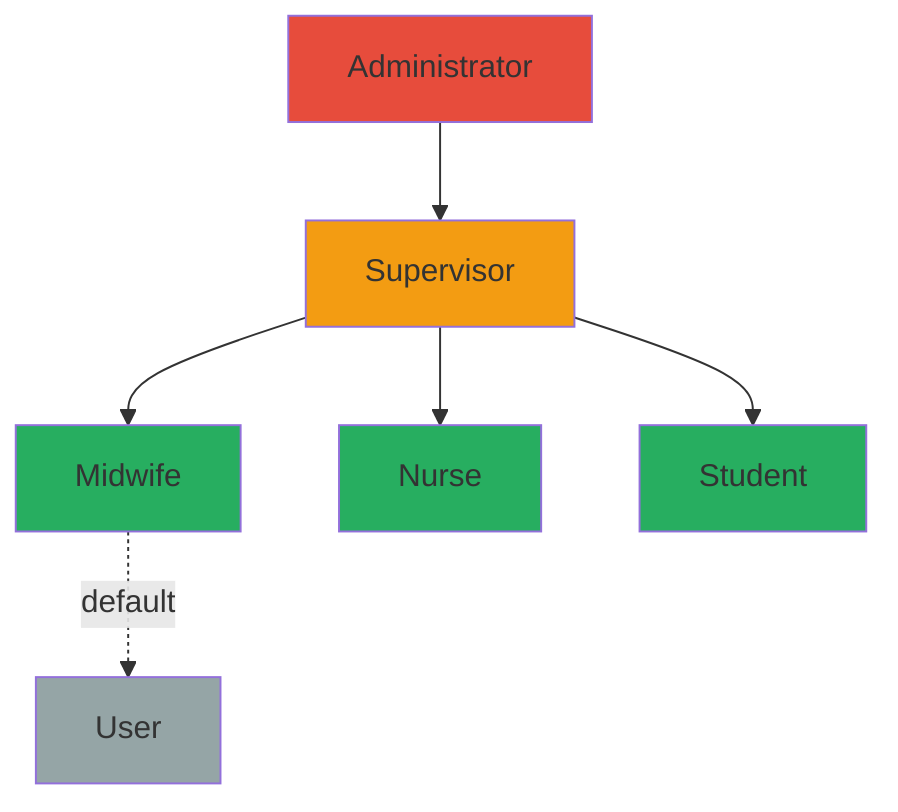

# MotivAid - User Roles & Permissions

## Role Hierarchy



---

## Role Definitions

### 1. User (Default)
> Unverified users who registered without a facility access code

| Attribute | Value |
|-----------|-------|
| Role Code | `user` |
| Access Level | Basic |
| Assigned When | No registration code provided |

---

### 2. Midwife (Primary Staff)
> Frontline healthcare worker using the app during deliveries

| Attribute | Value |
|-----------|-------|
| Role Code | `midwife` |
| Access Level | Standard |
| Assigned When | Registered with a `midwife` facility code |

---

### 3. Nurse (Staff)
> Clinical nurse supporting maternal care

| Attribute | Value |
|-----------|-------|
| Role Code | `nurse` |
| Access Level | Standard |
| Assigned When | Registered with a `nurse` facility code |

---

### 4. Student (Staff)
> Nursing or midwifery student in training

| Attribute | Value |
|-----------|-------|
| Role Code | `student` |
| Access Level | Standard |
| Assigned When | Registered with a `student` facility code |

---

### 5. Supervisor (Manager)
> Facility-level oversight and quality assurance

| Attribute | Value |
|-----------|-------|
| Role Code | `supervisor` |
| Access Level | Elevated |
| Assigned When | Registered with a `supervisor` facility code |

---

### 6. Administrator (System)
> Program-level management and configuration

| Attribute | Value |
|-----------|-------|
| Role Code | `admin` |
| Access Level | Full |
| Assigned When | Registered with an `admin` facility code |

---

## Permissions Matrix

| Feature | User | Midwife | Nurse | Student | Supervisor | Admin |
|---------|:----:|:-------:|:-----:|:-------:|:----------:|:-----:|
| **Authentication** |
| Login (online/offline/biometric) | yes | yes | yes | yes | yes | yes |
| Reset own password | yes | yes | yes | yes | yes | yes |
| **Dashboard** |
| View basic dashboard | yes | - | - | - | - | - |
| View staff dashboard | - | yes | yes | yes | - | - |
| View supervisor dashboard | - | - | - | - | yes | - |
| View admin dashboard | - | - | - | - | - | yes |
| **Facility Management** |
| Create/edit/delete facilities | - | - | - | - | yes | yes |
| Create/edit/delete units | - | - | - | - | yes | yes |
| Manage registration codes | - | - | - | - | yes | yes |
| Activate/deactivate codes | - | - | - | - | yes | yes |
| **Unit Management** |
| Switch active unit | - | yes | yes | yes | yes | yes |
| Request unit membership | - | yes | yes | yes | yes | - |
| Approve/reject memberships | - | - | - | - | yes | yes |
| **Profile** |
| View own profile | yes | yes | yes | yes | yes | yes |
| Edit own profile | yes | yes | yes | yes | yes | yes |
| Upload avatar | yes | yes | yes | yes | yes | yes |
| **Clinical Mode** |
| Access clinical tab | - | yes | yes | yes | yes | - |
| Create maternal profiles | - | yes | yes | yes | yes | - |
| Record vital signs | - | yes | yes | yes | yes | - |
| Complete E-MOTIVE steps | - | yes | yes | yes | yes | - |
| Manage case lifecycle | - | yes | yes | yes | yes | - |
| View own unit cases | - | yes | yes | yes | yes | - |
| View all unit cases | - | - | - | - | yes | yes |
| Trigger escalation (Planned) | - | yes | yes | yes | yes | - |
| **Training Mode** (Planned) |
| Access training | - | yes | yes | yes | yes | yes |
| Take quizzes | - | yes | yes | yes | yes | yes |
| View own progress | - | yes | yes | yes | yes | yes |
| **Reports** (Planned) |
| View own case reports | - | yes | yes | yes | yes | - |
| View unit reports | - | - | - | - | yes | yes |
| View all facilities | - | - | - | - | - | yes |
| Export reports | - | - | - | - | yes | yes |
| **Settings** |
| Theme selection | yes | yes | yes | yes | yes | yes |
| Sign out | yes | yes | yes | yes | yes | yes |

---

## Role-Based Dashboard Rendering

The Home screen (`app/(app)/(tabs)/index.tsx`) renders different components based on `profile.role`:

```typescript
const renderDashboard = () => {
  switch (profile?.role) {
    case 'admin':
      return <AdminDashboard />;
    case 'supervisor':
      return <SupervisorDashboard />;
    case 'midwife':
    case 'nurse':
    case 'student':
      return <StaffDashboard />;
    default:
      return <UserDashboard />;
  }
};
```

---

## Database Implementation

### Role Enum

```sql
CREATE TYPE public.user_role AS ENUM (
  'admin',
  'user',
  'supervisor',
  'midwife',
  'nurse',
  'student'
);
```

### TypeScript Type

```typescript
type Profile = {
  id: string;
  username: string | null;
  full_name: string | null;
  avatar_url: string | null;
  website: string | null;
  role: 'admin' | 'user' | 'supervisor' | 'midwife' | 'student' | 'nurse';
};
```

### Role Assignment Flow

1. User registers with `supabase.auth.signUp()` passing `registration_code` in metadata
2. PostgreSQL trigger `handle_new_user()` fires on `auth.users` INSERT
3. Trigger looks up the code in `facility_codes` table
4. If found, assigns the code's role to the new profile
5. If not found or no code provided, defaults to `'user'`

### Facility Codes Table

Each facility has one unique code per role:

```sql
CREATE TABLE public.facility_codes (
  id          UUID PRIMARY KEY DEFAULT gen_random_uuid(),
  facility_id UUID REFERENCES public.facilities(id) ON DELETE CASCADE,
  role        public.user_role NOT NULL,
  code        TEXT NOT NULL,
  is_active   BOOLEAN DEFAULT true,

  UNIQUE(facility_id, role),  -- One code per role per facility
  UNIQUE(code)                -- Codes are globally unique
);
```

**Code Format:** Acronym-based codes derived from facility names (e.g., `AKTH1-SUP`, `SMSSH1-MID`).

### RLS Policies

```sql
-- Profiles: public read, self-write
CREATE POLICY "Public profiles are viewable by everyone."
  ON public.profiles FOR SELECT USING (true);

CREATE POLICY "Users can update their own profile."
  ON public.profiles FOR UPDATE USING (auth.uid() = id);

-- Unit Memberships: self-read, supervisor full access
CREATE POLICY "Users can view their own memberships"
  ON public.unit_memberships FOR SELECT USING (auth.uid() = profile_id);

CREATE POLICY "Supervisors can manage memberships"
  ON public.unit_memberships FOR ALL USING (
    EXISTS (
      SELECT 1 FROM public.profiles
      WHERE id = auth.uid() AND role = 'supervisor'
    )
  );
```
